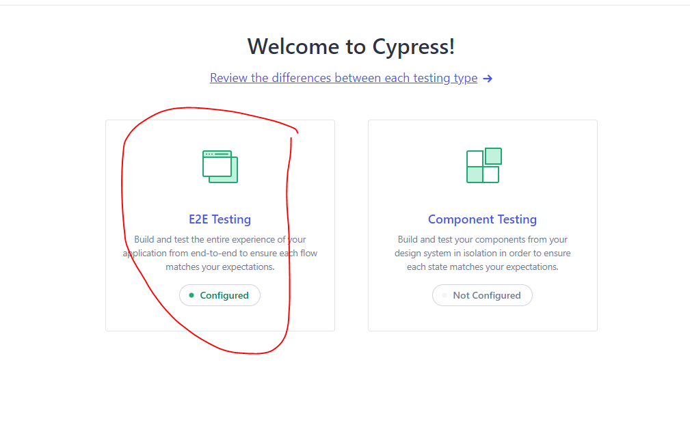
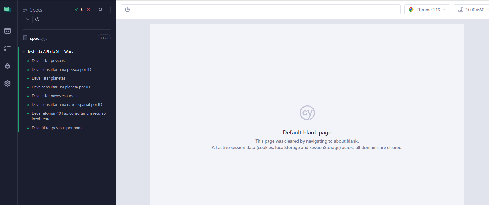

# Teste da API do Star Wars com Cypress

Este é um projeto de teste automatizado da API do Star Wars (swapi.dev) usando o framework de teste Cypress. Ele contém testes que verificam a funcionalidade da API.

## Requisitos

- [Node.js](https://nodejs.org/en).
- [Cypress]().

## Configuração

1. Clone este repositório em sua máquina local:

```bash
git clone https://github.com/AykoSousa/Software-Testing/APIStarWars.git
```

2. Navegue até o diretório do projeto:

```bash
cd APIStarWars
```

3. Instale as dependências do Cypress:

```bash
npm install
```

## Executando os Testes

1. Abra o painel do Cypress:

```bash
npx cypress open
```

2. Na interface do Cypress, clique no teste que deseja executar.



Os testes serão executados em seu navegador padrão.

## Estrutura do Projeto

- cypress/e2e/integration: Contém arquivos de teste Cypress.
- cypress/support: Contém scripts de suporte, como comandos personalizados.
- cypress.json: Arquivo de configuração do Cypress.

## Cenários de Teste
O projeto inclui os seguintes cenários de teste da API do Star Wars:

1. Listagem de Pessoas
2. Consulta de Pessoa por ID
3. Listagem de Planetas
4. Consulta de Planeta por ID
5. Listagem de Naves Espaciais
6. Consulta de Nave Espacial por ID
7. Consulta de Recursos Inexistentes
8. Filtragem de Pessoas por Nome

## Relatórios de Teste
Os resultados dos testes são exibidos no painel do Cypress e também podem ser exportados para diferentes formatos.



## Contribuições
Se você deseja contribuir para este projeto, sinta-se à vontade para abrir issues, propor melhorias ou enviar solicitações de pull. Ficarei feliz em receber sua contribuição e aprender mais!.