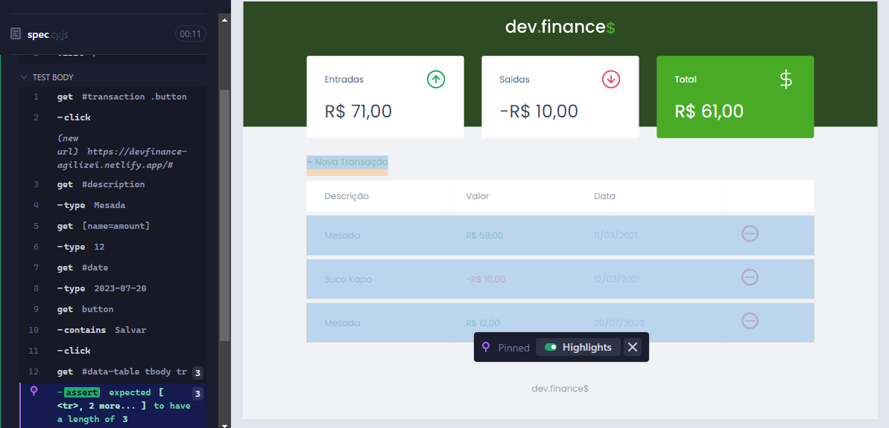
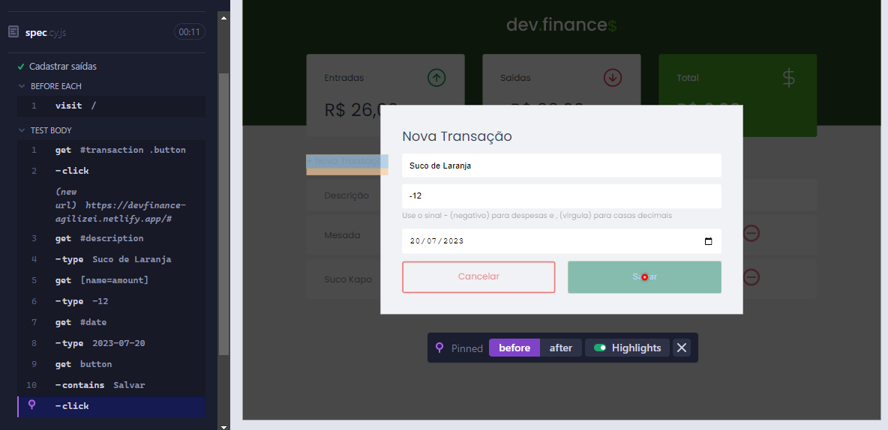
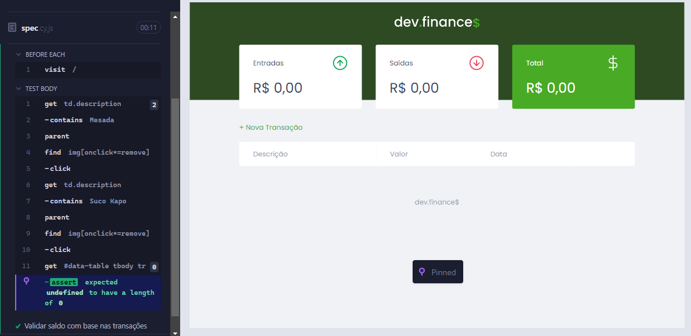
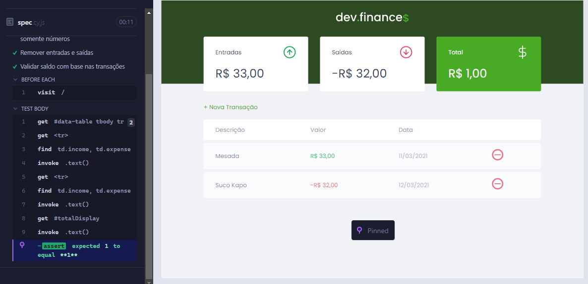

# Testando a Aplicação Devfinance

## Descrição:
O projeto consiste em uma aplicação web que permite o dev ter seu controle financeiro através de cadastro de entradas e saídas.
Esse projeto foi desenvolvido pelo professor Mayk Brito da Rocketseat, mas para validar os testes tive como base a playlist de [Cypress](https://www.youtube.com/playlist?list=PLnUo-Rbc3jjztMO4K8b-px4NE-630VNKY) do canal [Agilizei](https://www.youtube.com/@Agilizei).

### Ferramenta:
- [Cypress](https://www.cypress.io/)

### Link Site:
- https://devfinance-agilizei.netlify.app/#

### Rodar o projeto
```bash
 npx cypress open
```
Para esta aplicação validei as seguintes funcionalidades:
- Botão de cancelamento ao criar nova transação


- Cadastro de entradas



- Cadastro de saídas



- Verificação se campo de valor aceita somente números


- Remover entradas e saídas



- Validação do saldo total com base nas transações



Resultados obtidos no dashboard do Cypress


Output obtidos em vídeo

