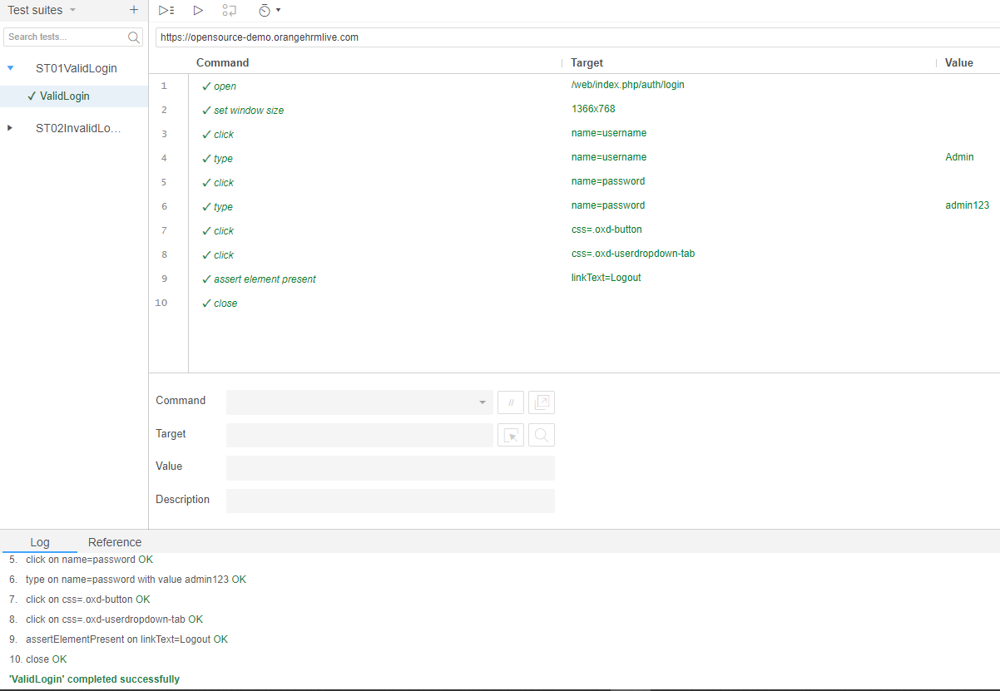
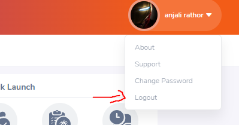
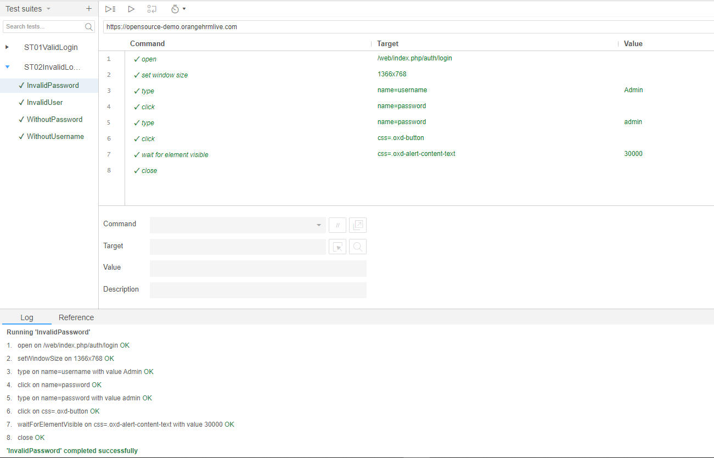
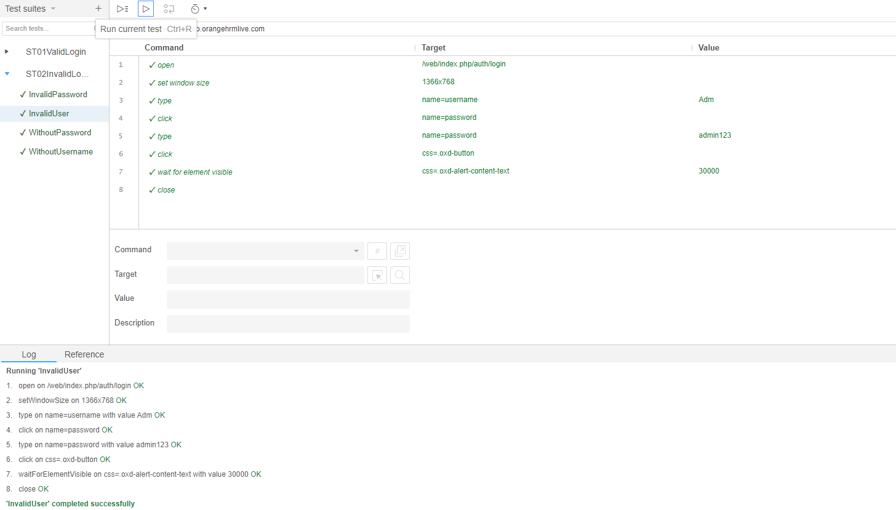
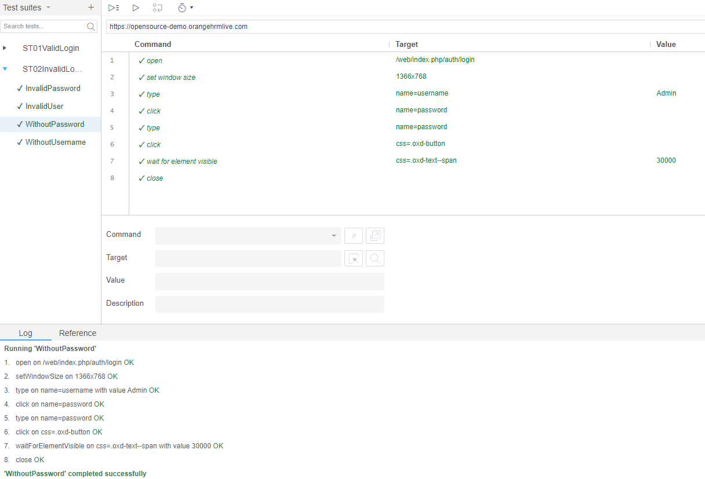
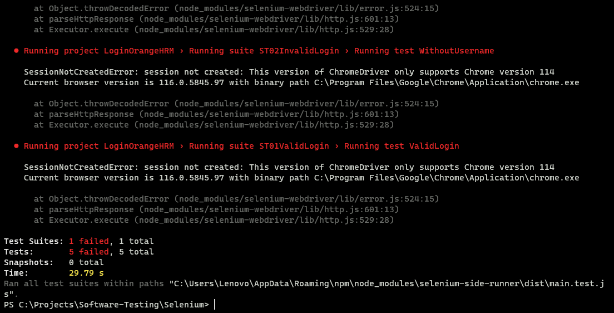

# Validação da funcionalidade de login com selenium IDE

## Ferramentas:
- [Selenium IDE](https://www.selenium.dev/selenium-ide/)
- [Windows Terminal](https://apps.microsoft.com/store/detail/windows-terminal/9N0DX20HK701?hl=pt-br&gl=br&icid=CNavAppsWindowsApps)
- [Node](https://nodejs.org/en)
- [Chrome Driver](https://chromedriver.chromium.org/downloads)

## Site Testado
- https://opensource-demo.orangehrmlive.com/web/index.php/auth/login

## Descrição
Neste caso de teste utilizo a ferramenta selenium IDE para validar a funcionalidade de login no site, na qual verifico se terei sucesso ao logar com usuário e senha válidos, ou se terei impedimentos quando utilizo um login inválido ou até mesmo deixando campos de e-mail ou senha vázios.

## Execução

### Login Válido
O próprio site fornece as credenciais de usuário e senha para acessarmos o site. Ao tentar fazer o login com o uso dessas credenciais vemos todos os testes passando.



Para realmente validar se estou logado no site, utilizo como referência o botão de logout que está localizado no dropdown do perfil.



Como visto acima, todos os testes passaram.

### Login Inválido
Para válidar esse cenário utilizo como referência a mensagem de erro "Invalid credentials"
1. Testando com **Senha Inválida**


2. Testando com **Usuário inválido**


3. Testando sem inserir **Username**


4. Testando sem inserir **Password**


### Utilizando o terminal
Para executar os testes via terminal iremos precisar do [Node](https://nodejs.org/en) instalado na máquina, além do node precisaremos também do [chrome driver](https://chromedriver.chromium.org/downloads) (**obs:** Verificar a versão do Chrome e baixar o driver correspondente, caso o contrário teremos erro ao executar. Passei por isso, pois meu Chrome atualizou para a versão 116 e a versão mais recente do chrome driver ainda é a 114).

O chrome driver vem em uma pasta .zip, então é só descompactar e colocar o executável no Disco Local (C:)

1. Com o node instalado iremos executar o seguinte script
```
> brew install node
> npm install -g selenium-side-runner
```
**OBS:** Na primeira vez em que rodei o "npm install -g selenium-side-runner", obtive um erro (npm ERR! code ERR_SOCKET_TIMEOUTnpm ERR!) dizendo que o npm não conseguiu fazer o GET para a instalação do side-runner e que poderia ser uma configuração de proxy. Então consultei aos gurus da internet (Indianos) e basta realizar o seguinte comando:
```
npm config set registry http://registry.npmjs.org/
```
após isso, reiniciar o PC que dará tudo certo! Aqui está o vídeo que usei como referência: https://www.youtube.com/watch?v=s-GA1_5oev4.

2. Navegar até o diretório onde está o arquivo .side gerado quando salvamos os testes e rodar o comando:
```
> selenium-side-runner /path/to/your-project.side
```
Assim automaticamente os testes serão executados via terminal.